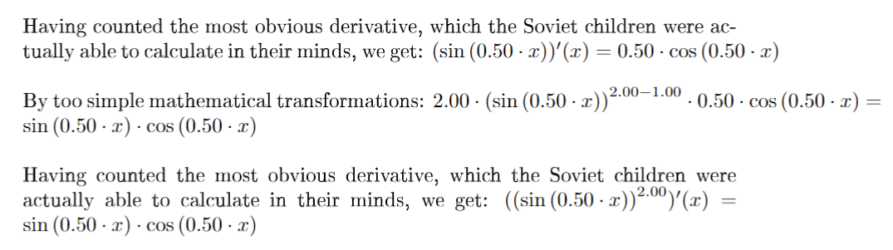
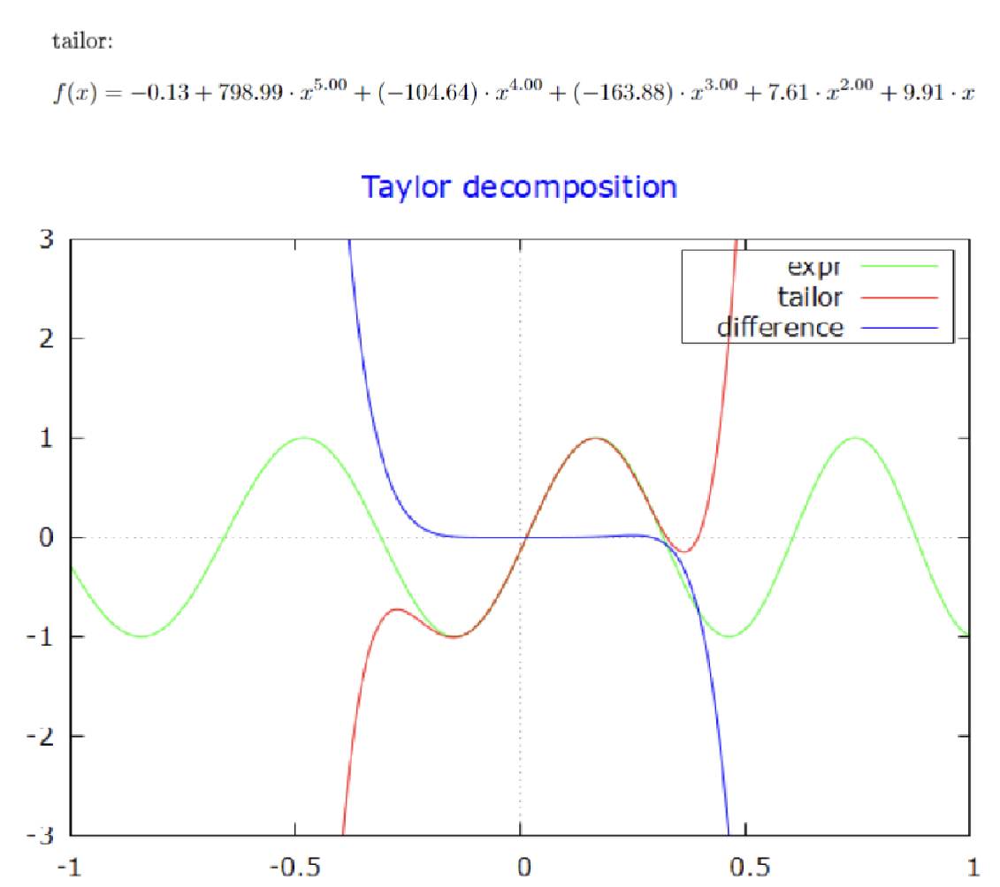
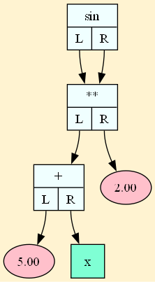
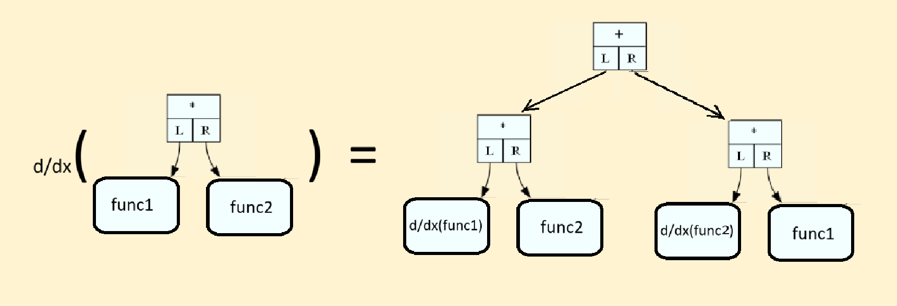
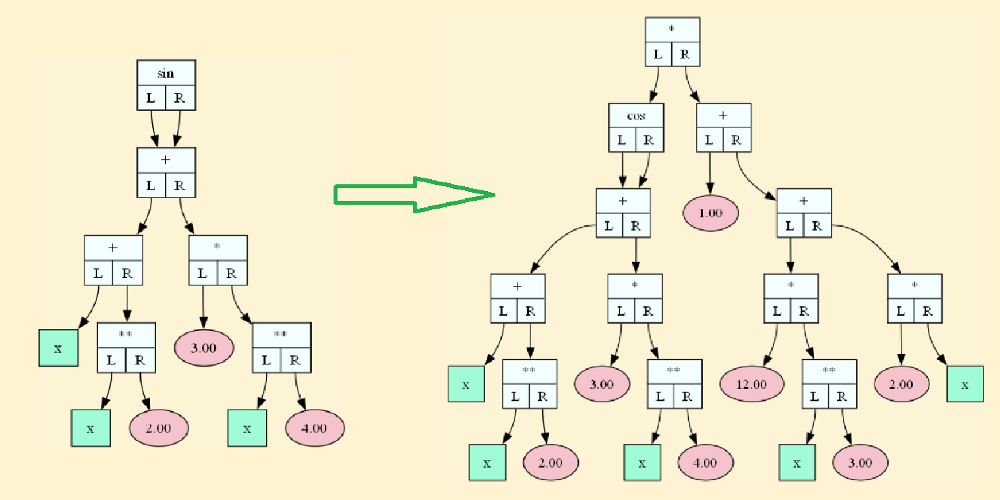
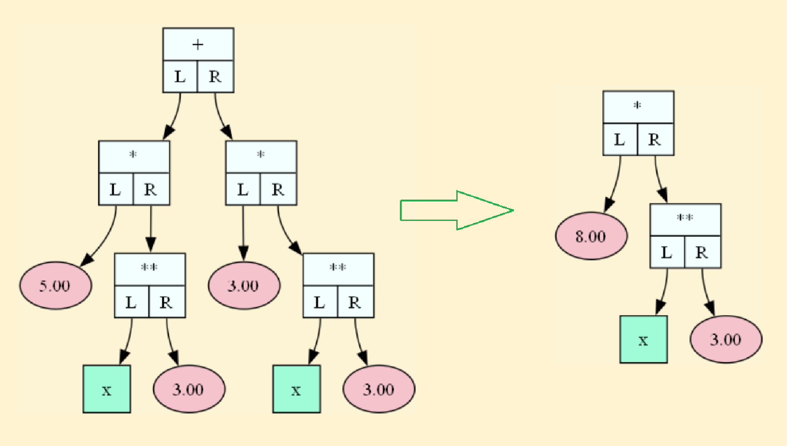
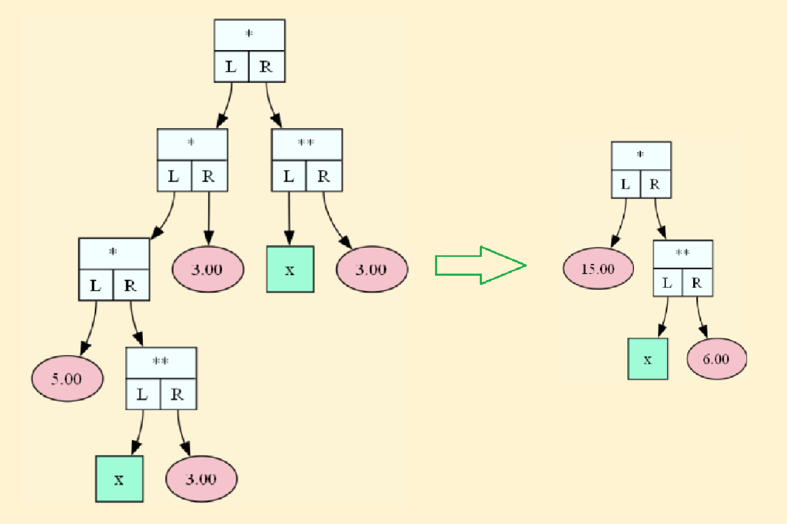

# Дифференциатор

Шелонин Арсений, студент 1 курса ФРКТ МФТИ

## Описание проекта

Проект представляет собой программу, которая считывает введённую функцию и рассчитывает её производную или раскладывает по тейлору до $o(n)$, строя аппроксимирующую кривую по многочлену Тейлора. Вместе с этим программа на latex генерирует pdf-файл с пошаговыми пояснениями к каждому своему действию и графиком исходного выражения и многочлена Тейлора.

## Сборка и запуск
_Программа написана под систему Windows_

### Сборка
1. Клонируйте репозиторий
```bash
$ git clone https://github.com/71frukt/DIFFERENTIATOR.git
```

2. Соберите проект. По умолчанию компилируется режим Тейлора, с флагом для make `MODE=DERIVATIVE` программа просто рассчитает производную функции. 

Режим разложения по Тейлору:
```bash
$ make
```
или
```bash
$ make MODE=TAYLOR
```

Режим производной:
```bash
$ make MODE=DERIVATIVE
```

### Запуск
```bash
$ cd build
$ main.exe <input_file> <output_file>
```

#### Формат входного файла
`<input_file>` должен содержать выражение от $x$ и завершаться символом $\$$. 


<details>
<summary>Поддерживаемые математические операторы и функции</summary>

|         |         |
|---------|-------
|   +     | сложение
|   -     | вычитание
|   *     | умножение
|   /     | деление
|   **    | возведение в степень
|   ln    | натуральный логарифм
|   log   | логарифм по основанию 10
|   sin   | синус
|   cos   | косинус
|   tg    | тангенс

</details>

Вот пример содержимого входного файла:
```
sin (x / 2) ** 2 * x ** (3 / x) $
```

По завершении программой будет создан <output_file> формата pdf. Вот пример его фрагментов для разложения функции $sin ((x + 5) ^ 2)$ до $o(x^5)$:

_Вычисление производной и упрощение_

<table align="center" width="60%">
  <tr>
    <td>
      
    </td>
  </tr>
</table>

<!-- <div style="width: 60%; margin: 0 auto;">
  
</div> -->

_Итоговый многочлен Тейлора и график_


<table align="center" width="60%">
  <tr>
    <td>
      
    </td>
  </tr>
</table>

<!-- <div style="width: 60%; margin: 0 auto;">
  
</div> -->


## Принцип работы
Для вычисления производной строится дерево, соответствующее введённой функции. Для функции  $sin ((x + 5) ^ 2)$ он выглядит так:


<table align="center" width="15%">
  <tr>
    <td>
      
    </td>
  </tr>
</table>

<!-- <div style="width: 15%; margin: 0 auto;">
  
</div> -->

Каждый узел имеет своё правило дифференцирования, и при взятии производной он и его поддерево преобразуется по особым правилам. Если узел - константа, то при дифференцировании его значение становится 0, переменная превращается в константу со значением 1. Если узел - математическая операция, то производная рассчитывается по правилам дифференцирования: для `+` рассчитываются производные левого и правого поддерева; 

Для `*` схема дифференцирования выглядит так: 

<table align="center" width="65%">
  <tr>
    <td>
      
    </td>
  </tr>
</table>

<!-- <div style="width: 65%; margin: 0 auto;">
  
</div> -->

Для других математических операций производная определяется аналогичным образом. Если это функция - то производная рассчитывается как производная сложной функции.

Вот пример взятия производной от функции $f(x) = sin(x + x^2 + 3x^4)$

<table align="center" width="75%">
  <tr>
    <td>
      
    </td>
  </tr>
</table>

<!-- <div style="width: 75%; margin: 0 auto;">
  
</div> -->


## Упрощение выражений
Программа умеет сворачивать операции с константами. 

Кроме того, программа приводит подобные слагаемые. Это реализуется следующим образом: 
1. Каждый узел с переменной приводится к общему виду $a x^n$ ($x$ -> $1 * x^1$).
2. Далее, получив общий вид для всех переменных, программа может сворачивать степени и множители.
3. Высшие степени переносятся в левую часть уравнения.
4. Подобные слагаемые вида $a x^n$, находящиеся при одной вершине `+`, при одинаковых степенях складываются.
5. Одночлены, находящиеся при одном узле `*`, перемножаются.

Таким образом, программа умеет осуществлять упрощение таких конструкций: 

<table align="center" width="65%">
  <tr>
    <td>
      
    </td>
  </tr>
</table>

<!-- <div style="width: 65%; margin: 0 auto;">
  
</div> -->

<table align="center" width="65%">
  <tr>
    <td>
      
    </td>
  </tr>
</table>

<!-- <div style="width: 65%; margin: 0 auto;">
  
</div> -->

---
